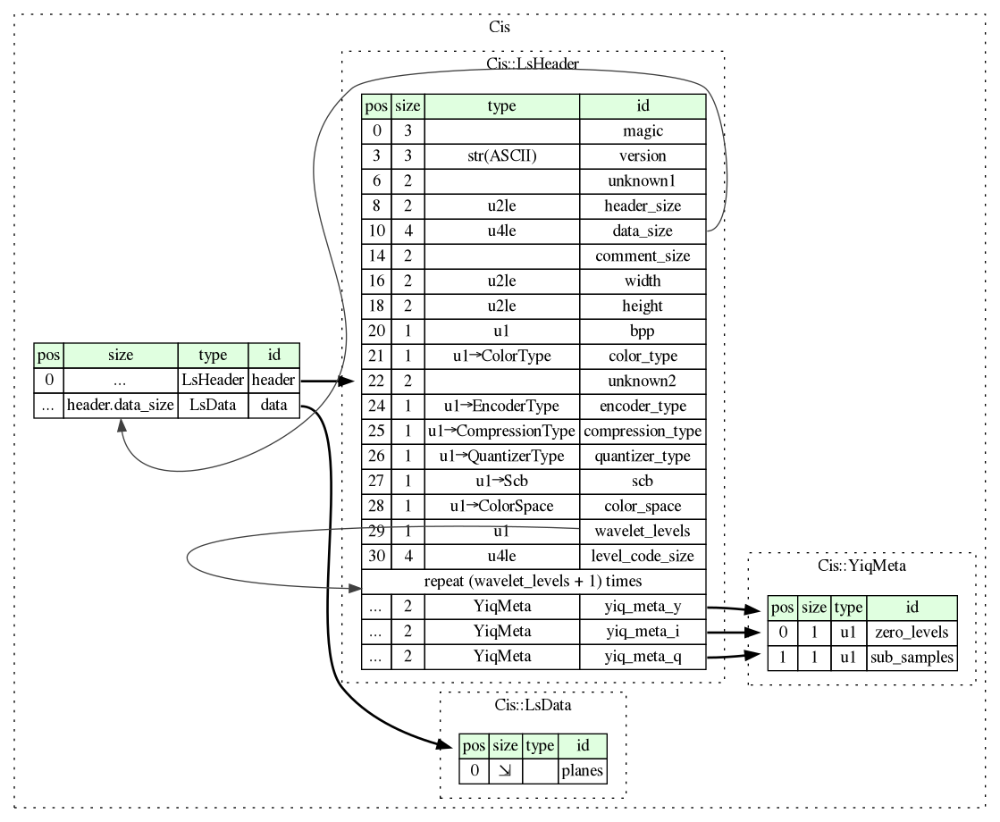

This page will be regularly updated by incorporating information from the posts.

# Introduction

# History

## Names

- Lightning Strike: the trademark registered as the product name for
  the compression technology
- COD: [very likely](/2025/05/07/understanding-the-cis-cod-image-file-format.html) stands for "coded" (image)
- CIS: [almost
  certainly](/2025/07/02/companies-locations-dates-and-people.html)
  stands for "Computer and Information Sciences, Inc.", a company that
  was involved in the implementation of the Lightning Strike image
  codec.

## Companies

- *Computer and Information Sciences, Inc.*
- *Infinop, Inc.* (also called *Infinet Op* in the help file of the
  *Lightning Strike Image Compressor (LSIC)* version 2.5, in [MacUser
  05/1996, page
  28](https://vintageapple.org/macuser/pdf/MacUser_9605_May_1996.pdf),
  and on some contemporary web pages)
- *Infinitron Research International, Inc.*

([described here](/2025/07/02/companies-locations-dates-and-people.html))

# Versions

There exist at least four versions:
- 2.3
- 2.4
- 2.5
- 3.0

These do not necessarily match the version numbers of the
[software](#software) described below -- see [Compatibility with File
Format Versions](#compatibility-with-file-format-versions).

# File format

Visualization of the file format (for version 3.0) generated from
[cis.ksy](resources/cis.ksy) using [Kaitai
Struct](https://kaitai.io/):

# Coding / compression

# Software

## Lightning Strike Image Compressor (LSIC)

| version                | 2.5                              | 2.6                              |
|------------------------+----------------------------------+----------------------------------|
| file name              | lsic25.exe                       | lsic.exe                         |
| file size              | 126976 bytes                     | 601088 bytes                     |
| file date              | 1996-04-11                       | 1996-10-17                       |
| file MD5 hash          | 3f6d7e0c8260e51f61b3fdf85efd8931 | 1a4ed8edeb6bbd66ff3bad6c0a3e0276 |
| supported file formats | .bmp, .cod, .tga                 | .bmp, .cod, .tga, .gif, .jpg     |
| source                 | [lsic25.zip]                     | [LSIC26~1.ZIP]                   |

[lsic25.zip]: https://web.archive.org/web/19970619034938/http://www.compsci.com/lstrike/windows/CODEC/lsic25.zip
[LSIC26~1.ZIP]: https://web.archive.org/web/19961106190151/http://euclid.infinop.com:80/html/LSIC26~1.ZIP

### LSIC 2.5

- can resize image
- "master setup" allows fine-grained control over compression
  parameters:
  - number of A, B, and C levels
  - quantization vectors
  - total levels
  - threshold vector

### LSIC 2.6

- can sharpen image and apply some filters
- "master setup" allows fine-grained control over compression
  parameters:
  - levels to discard
  - levels to sample
  - quantization vectors
  - total levels
  - threshold vector
  - The help file states: "LSIC 2.6 increases compression ratio
    approximately 10% over LSIC V2.5. The new format of coded file can
    be decompressed in incremental mode."

### LSIC 3.0

According to the [patent WO1998040842A1 "System and method for image
compression and
decompression"](https://patents.google.com/patent/WO1998040842A1),
there existed a "Lightning Strike™ Image Compressor (LSIC) version
3.0".

## Web Browser Plugin

|  version |          | file name     |   file size | date                  | file MD5 hash                    | source                        |
| -------: | -------: | :------------ | ----------: | :-------------------- | :------------------------------- | :---------------------------- |
|      1.7 | 16 bit   | NPCOD16.DLL   |      125312 | 1996-04-23 (DLL)      | 7c7c5df1f7ea6c95acb7118d1e995093 | [ls16tiny.exe], [lstplug.exe] |
|      1.7 | 32 bit   | NPCOD32.DLL   |      179712 | 1996-04-23 (DLL)      | 2d4f3656979c2cc27145f25b379c7bec | [ls32tiny.exe], [lstplug.exe] |
|    2.6.0 | 32 bit   | NPLS32.DLL    |      237056 | 1997-02-14 (README)   | bd3c81d8185588b9ca76af8b196897df | [ls26.exe]                    |
|    3.1.3 | 32 bit   | NpLS32.dll    |      280064 | 1997-09-29 (DLL)      | d9c1b69f2a5081350c66bc23b696b582 | [lsnswi32.exe]                |

[ls16tiny.exe]: https://web.archive.org/web/19970619034318/http://www.compsci.com/lstrike/windows/ls16tiny.exe
[ls32tiny.exe]: https://web.archive.org/web/19970619034318/http://www.compsci.com/lstrike/windows/ls32tiny.exe
[lstplug.exe]: https://web.archive.org/web/19970619034318/http://www.compsci.com/lstrike/windows/lstplug.exe
[ls26.exe]: ftp://www.nic.funet.fi/.m/mirrors/Archived/papa.indstate.edu/winsock/Windows95/WWW-Browsers/Plug-In/ls26.exe
[lsnswi32.exe]: https://web.archive.org/web/19971108045501/http://www.infinop.com:80/fhtml/

## Lightning Strike Video Codec 3.5

| file name   |   file size |     file date | file MD5 hash                    |
| :---------- | ----------: | ------------: | :------------------------------- |
| lsvc30.dll  |       83968 |    1998-04-23 | 7162a06af5c258caccb2ee1e9bde6441 |
| lsvc.dll    |      123392 |    1998-05-12 | ebe72859ffd2da2d280d9f08b73a302f |
| lsvd30.dll  |       91648 |    1998-04-23 | 3746ceafe7ec518a96421ca4515ddbbb |

source: [lsvideo5_NT.zip]

[lsvideo5_NT.zip]: https://web.archive.org/web/19980612221627/http://www.infinop.com:80/fhtml/lsvideo5_NT.zip

## Lightning Strike Video Messenger 2.4

| file name          |   file size |     file date | file MD5 hash                    |
| :----------------- | ----------: | ------------: | :------------------------------- |
| encvm.dll          |      229376 |    1999-01-03 | 9b509174dae3f519a65228e2e437c7dc |
| lsvmplus.dll       |      262144 |    1999-01-03 | 5d67c1410ec5ec0f5011fd0a4c62bc11 |
| VideoMessenger.exe |      985367 |    2000-04-03 | 7ef54e6303c09f022b51060c20005586 |

source: [Neo Volume 5](https://archive.org/details/neo05-cd-set)

## Other DLLs

| file name     |   file size | file date    | file MD5 hash                    | source           |
| :------------ | ----------: | :----------- | :------------------------------- | :--------------- |
| lsd26dll.dll  |       69632 | 1996-08-07   | fb3fc544f1a0b94fc286f1eb43bd1bbd | D-Sat 1          |
| lsvxdec.dll   |      204800 |              | e93ad6b252aaa2631dbc1bd7abca00f9 | [GitHub]         |

[GitHub]: https://github.com/jjbunbury/mplayer-codecs/blob/master/lsvxdec.dll

## Java

A Java browser applet and application for reading CIS/COD images is
contained in
[NEWJAVA.ZIP](https://web.archive.org/web/19961106190832/http://euclid.infinop.com:80/html/java/NEWJAVA.ZIP). The
app(let) can open some (but not all!) version 3.0 CIS/COD images.

## Compatibility with File Format Versions

| software              |  version | 2.3  | 2.4  | 2.5        | 3.0        |
| :-------------------- | :------- | :--  | :--  | :--------- | :--------- |
| LSIC                  |      2.5 | read | read | read/write | -          |
| LSIC                  |      2.6 | -    | -    | -          | read/write |
| browser plugin 16 bit |      1.7 |      |      |            |            |
| browser plugin 32 bit |      1.7 | read | read | read       | -          |
| browser plugin 32 bit |    2.6.0 | read | read | read       | read       |
| browser plugin 32 bit |    3.1.3 | read | read | read       | read       |
| lsd26dll.dll          |          |      |      |            | read       |

The browser plugins have an option to write (a previously opened)
CIS/COD file which creates a copy of the file.

# Use

- [D-Sat](https://de.wikipedia.org/wiki/D-Sat), at least version 1
- possibly [Dark Reign](https://en.wikipedia.org/wiki/Dark_Reign:_The_Future_of_War)

# References

# Further reading

# External links

- <http://justsolve.archiveteam.org/wiki/Lightning_Strike>
